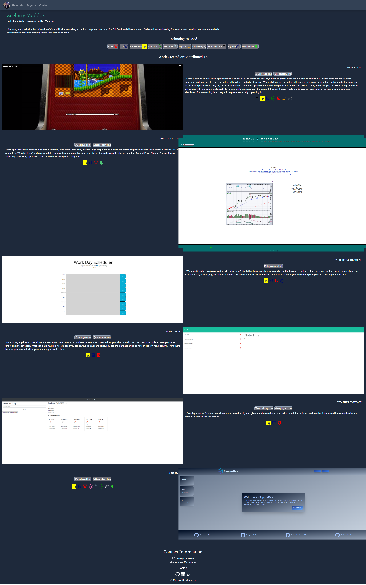

# React-Portfolio

## Description

This is my ,Zachary Maddox, React Portfolio. Inside you'll find five of my previous projects I have built myself or helped in creating. Along side the images you will see the deployed link to the website or the github repository if available. Each project has the applications used to create said project along with a brief description.
Repository Link:
https://github.com/Zachary-Maddox/React-Portfolio
Deployed Link:
https://zachary-maddox.github.io/React-Portfolio/

## Table of contents

-   [license](#license)
-   [installation](#installation)
-   [usage](#usage)
-   [contributing](#contributing)
-   [questions](#questions)

    ## License

No Liscenes

## Installation

Visit the repository's link to view the applications structure and files.
https://github.com/Zachary-Maddox/React-Portfolio

## Usage

To display skills obtained during my coding bootcamp at The University of Central Florida to future employers.

## Contributing

Not accepting contributions for this repository.
You may NOT fork the repository or use it for any personnel gain.

## Questions

Any questions or suggestion may be sent via GitHub:Zachary-Maddox
